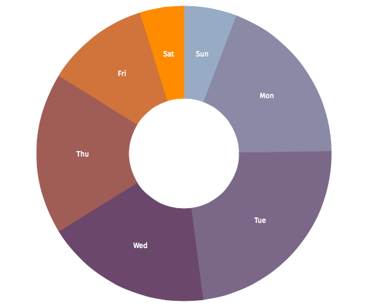
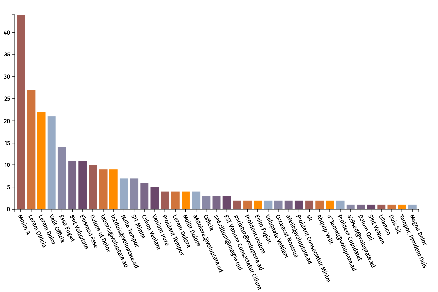
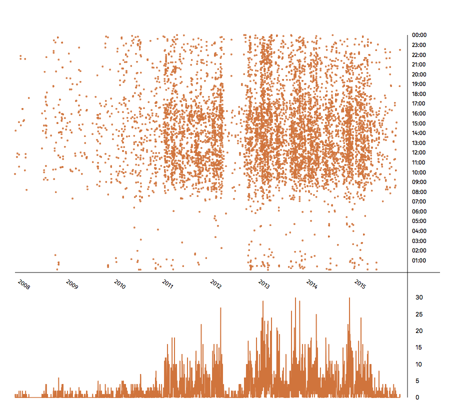

# Visualize bundle for [MailMate](http://freron.com/ "MailMate")

Visualize email history and trends.

# Installation

You can install this bundle in MailMate by opening the preferences and going to the bundles tab. After installation it will be automatically updated for you.

# Usage

Select a few - or many! - messages in any folder or in your Inbox.

Then invoke "Emails by sender" or "Emails by time" from the Command > Visualize menu, or using the "^B" or "^T" shortcuts respectively.

The plots will then be displayed in Safari.

Hover over parts of the pie chart, bars in the bar chart, or dots in the scatterplot to display more information.

Use the "Save as Image" buttons to produce `.png`s from the plots for your records.

Have fun :)

# License

If not otherwise specified (see below), files in this repository fall under the following license:

> Permission to copy, use, modify, sell and distribute this
software is granted. This software is provided "as is" without
express or implied warranty, and with no claim as to its
suitability for any purpose.

An exception is made for files in readable text which contain their own license information, or files where an accompanying file exists (in the same directory) with a “-license” suffix added to the base-name name of the original file, and an extension of txt, html, or similar.

# Thanks

To Benny, excellent developer of MailMate, for providing tons of help with the bundle.